<h1 align="center"><strong>Build a Smart Bilingual AI Chatbot for Your Website<br>Google Gemini + RAG Tutorial</strong></h1>

<p align="center">
  <a href="https://youtu.be/zuBhmYDYfNc">
    
  </a>
</p>

<p align="center">
  <a href="https://youtu.be/zuBhmYDYfNc">Build a Smart Bilingual AI Chatbot for Your Website | Google Gemini + RAG Tutorial</a>
</p>

## Introduction

This repository contains the complete source code for a sophisticated, bilingual (English/Hungarian) RAG (Retrieval-Augmented Generation) chatbot. The chatbot is designed to be embedded as a widget on a website and acts as a knowledgeable team member for the company "Accaderi," answering questions about its dual expertise in Architecture and AI/Software Development.

The system is built with a modern, serverless architecture, using a static frontend for the chat interface and a Vercel serverless function for the secure backend logic. It leverages Google's Gemini family of models for its natural language understanding, generation, and translation capabilities.

This document serves as a comprehensive guide to the project's architecture, features, and the process for setup and adaptation.

## System Architecture

The diagram below illustrates the high-level architecture of our bilingual RAG chatbot system, showing the interaction between the user's browser (public), the secure backend on Vercel, and the Google Cloud API services. The system processes queries through a sophisticated pipeline that handles both standalone questions and contextual follow-ups.
<p align="center">
  
</p>

### Detailed System Flow

The diagram above provides a comprehensive view of the complete system workflow, from the initial user interaction on the main website through the one-time setup process, showing how Hungarian queries are processed through the RAG pipeline with multiple LLM integration points. 

*Note: This diagram focuses on the overall system architecture and query processing flow. The detailed conversational memory pipeline (including follow-up question handling, query rewriting, and dynamic scoring) is illustrated separately in the flowchart in the **[Conversational Memory & The Advanced RAG Pipeline](#conversational-memory--the-advanced-rag-pipeline)** section below.*

<p align="center">
  
</p>


## How It Works: The RAG Pipeline

The chatbot's intelligence is not pre-programmed; it's derived from a knowledge base through a process called Retrieval-Augmented Generation. Here’s a step-by-step overview of the workflow:

1.  **The Knowledge Base (`knowledge_en.md`):** The foundation of the chatbot's knowledge is a single, comprehensive Markdown file written in English. This file was created by scraping the official website and then critically enhancing it for AI consumption. Key adjustments included:
    *   **Adding Q&A Sections:** Project pages and FAQs were restructured into a question-and-answer format, making it easier for the AI to find direct answers.
    *   **Enriching Content:** Vague descriptions were enriched with explicit keywords (e.g., adding the word "hotel" to hotel projects) to improve semantic search.
    *   **Neutralizing Tone:** First-person text ("I believe...") was converted to a neutral, third-person perspective ("Our philosophy is...") to avoid confusing the chatbot's persona.

2.  **The Indexer (`indexer.js`):** This is a crucial, one-time script that you run locally. Its job is to:
    *   Read the `knowledge_en.md` file.
    *   Split the text into small, manageable, overlapping chunks.
    *   Use Google's embedding model (`text-embedding-004`) to convert each chunk into a mathematical representation (a vector).
    *   Save these vectors and their corresponding text into a single file, `api/rag-data_en.json`. This file acts as our project's private **Vector Database**.

3.  **The Frontend (`script.js` & `chatbot-loader.js`):** When a user asks a question, the frontend sends the query, the current language (`en` or `hu`), and the recent conversation history to our secure backend.

4.  **The Backend (`api/chat.js`):** This is the "brain" of the operation. When it receives a request, it performs the RAG pipeline:
    *   **Retrieve:** It first converts the user's question into a vector and compares it against all the vectors in `rag-data_en.json`. It retrieves the top 8 most semantically similar chunks of text from the knowledge base.
    *   **Augment:** It then combines these retrieved chunks with the user's question, conversation history, and a detailed set of persona rules into a single, large prompt.
    *   **Generate:** Finally, it sends this augmented prompt to the Google Gemini LLM, which generates a coherent, context-aware answer.

This process ensures that the chatbot's answers are grounded in your specific data, making them accurate and relevant.

## Core Features & Components

### 1. The Language Model (LLM)

The chatbot uses Google's `gemini-1.5-flash-latest` model for its primary generation tasks. This model was chosen for its excellent balance of speed, intelligence, and cost-effectiveness. The model name is defined as a constant in `api/chat.js` and can be easily swapped for another model or provider.

### 2. Conversational Memory

The chatbot can understand the context of a conversation and answer follow-up questions (e.g., if you ask about a project and then say, "tell me more about it," it knows what "it" refers to).

*   **How it Works:** The frontend (`script.js`) maintains the full conversation history in the browser's `sessionStorage`, making it persistent through page reloads. For efficiency, only the last 6 turns of the conversation are sent to the backend with each new query.
*   **Resetting:** A "New Chat" button in the UI allows the user to clear the session history and start a new, fresh conversation.
*   **Learn More:** The chatbot uses a sophisticated "Smart Retrieval Pipeline" to handle follow-up questions and avoid repetition. You can read a detailed, step-by-step explanation of this process in the **[Conversational Memory & The Advanced RAG Pipeline](#conversational-memory--the-advanced-rag-pipeline)** section below.

### 3. Interactive Navigation Links

When the chatbot describes a project, it programmatically appends a helpful navigation button to its response. This logic is handled entirely on the backend and does not rely on the LLM. It detects which project(s) are mentioned in the LLM's final answer and generates a context-aware button:
*   **1 Project Mentioned:** Links to the specific project page.
*   **Multiple Projects (Same Section):** Links to the general projects page for that section.
*   **Multiple Projects (Different Sections):** Provides a text hint instead of a single button.

### 4. Frontend Integration Scripts (`languageSwitcher.js` & `script_indexes.js`)

The chatbot is not a standalone application; it is deeply integrated with the main website's navigation and language systems.
*   **`languageSwitcher.js`:** This script manages the bilingual functionality of the main website. It contains the master `translations` object and a global `getEffectiveAppLanguage()` function. Crucially, it dispatches a `languageChanged` custom event that the `chatbot-loader.js` listens for, ensuring the chatbot's language stays in sync with the main page.
*   **`script_indexes.js`:** This is the main navigation script for the `architecture/` and `software/` sections of the website. It was modified to include a new priority-based `initializePage()` function. This function's primary job is to listen for a `chatbot_navigation_command` in `sessionStorage`, allowing the chatbot to programmatically control the main page's navigation and direct the user to specific project pages.

## Conversational Memory & The Advanced RAG Pipeline

The core of this chatbot's intelligence, especially its ability to handle conversations with a cost-effective LLM, lies in its sophisticated, multi-stage RAG (Retrieval-Augmented Generation) pipeline. This process is much more than a simple "search and answer" loop; it's an engineered system designed to create the best possible context *before* the final answer is generated.

The primary goal of the pipeline is to overcome two main weaknesses of a simple RAG system:
1.  **Vague Follow-up Questions:** A simple vector search for a query like "tell me more about it" will fail because it lacks context.
2.  **Repetitive Answers:** A simple search might retrieve the same context chunks for a follow-up question, leading to the bot repeating itself.

Our pipeline solves both of these problems programmatically. Let's trace the complete journey of a user's query.

---

### Scenario A: The Standalone Question

This is the simplest path, for a clear, self-contained question.
**Example Query:** `"Tell me about the Burj Khalifa project"`

1.  **Request Arrives:** The backend (`api/chat.js`) receives the query with an empty `history` array.
2.  **Initial Checks:** The system determines that this is not a follow-up question. The query is simplified to English keywords (if necessary).
3.  **Intelligent Search (`findRelevantChunksImproved`):** A standard vector search is performed. With no history, no scoring penalties are applied, and the top 8 most relevant chunks are retrieved based purely on semantic similarity.
4.  **Final Answer Generation:** The high-quality context is sent to the Gemini LLM, which generates a detailed, accurate answer.

---

### Scenario B: The Follow-up Question (The Advanced Path)

This is where the true power of the pipeline is revealed.
**Example Query:** `"tovabbi adatok errol"` (more data about this)
**History:** `[{ role: 'user', content: 'Burj Khalifa' }, ...]`

1.  **Request Arrives:** The backend receives the vague query and the rich `history` array.

2.  **Step 1: The "Memory" Stage - Is this a Follow-up?**
    *   The `isQueryAskingForSpecificDetails` function is called. It uses the LLM to quickly determine if the new query is a direct follow-up. In this case, it returns **`"yes"`**, activating the advanced logic.

3.  **Step 2: Intelligent Retrieval - Rewriting the Query**
    *   The `rewriteQueryForRetrieval` function is called. It uses the history to transform the vague query `"tovabbi adatok errol"` into a complete, standalone question like `"Tell me more about the Burj Khalifa project"`.
    *   This standalone question is then passed to `simplifyQueryToEnglish`, resulting in a high-quality search query.

4.  **Step 3: The Intelligent Search with Dynamic Scoring (`findRelevantChunksImproved`):**
    *   The vector search is performed using the high-quality, rewritten query.
    *   **Dynamic Scoring:** The function then checks if any of the retrieved chunks were already used in a previous assistant response from the `history`. If a chunk **was already used**, its similarity score is **penalized**, making it less likely to be chosen again.
    *   **Result:** The top 8 chunks returned are now heavily biased towards providing **new and different information**, preventing the bot from repeating itself.

5.  **Final Answer Generation:**
    *   This new, non-repetitive context is combined with the full history and the user's original follow-up question. The LLM then generates a follow-up answer that provides additional details.

This sophisticated pipeline is the key to the chatbot's advanced conversational abilities. Specifically, the query rewriting and dynamic down-scoring of used context allow a cost-effective LLM to maintain a coherent, intelligent, and non-repetitive conversation, making the chatbot more capable.

```mermaid
---
title: Hungarian Query Processing Flow - RAG System with LLM Integration
---
flowchart TD
    A[Hungarian User Query] --> B{Query Length > 3?}
    B -->|No| C[Return Fallback Response]
    B -->|Yes| D{Is Follow-up Query?}
    
    %% Initial Query Path
    D -->|No - Initial Query| E[Load English RAG Data]
    E --> F["🤖 LLM: Simplify Hungarian Query to English Keywords"]
    F --> G[Find Relevant Chunks using Embedding Similarity]
    G --> H[Build Context from Top 8 Chunks]
    
    %% Follow-up Query Path  
    D -->|Yes - Follow-up| I[Load English RAG Data]
    I --> J["🤖 LLM: Extract Topics from Conversation History"]
    J --> K[Expand Context with Topic-Relevant Chunks]
    K --> L["🤖 LLM: Rewrite Follow-up as Standalone Query"]
    L --> M["🤖 LLM: Simplify Rewritten Query to English"]
    M --> N["Find Relevant Chunks with Penalty for Previously Used Content"]
    N --> O[Build Enhanced Context]
    
    %% Common Processing Path
    H --> P["🤖 LLM: Check if Query is Follow-up for Detail Detection"]
    O --> P
    P --> Q["🤖 MAIN LLM: Generate Response using Hungarian Bilingual Prompt<br/>Process: Analyze in English → Apply Rules → Translate to Hungarian"]
    Q --> R[Check for Project References in Response]
    R --> S{Projects Found?}
    S -->|Yes| T[Add Navigation Links with Hungarian Labels]
    S -->|No| U[Return Response As-Is]
    T --> V[Final Hungarian Response with Navigation]
    U --> V
    V --> W[Log Conversation & Send to User]
    
    %% Styling
    classDef startEnd fill:#e1f5fe,stroke:#01579b,stroke-width:2px
    classDef process fill:#f3e5f5,stroke:#4a148c,stroke-width:2px
    classDef decision fill:#fff3e0,stroke:#e65100,stroke-width:2px
    classDef aiprocess fill:#e8f5e8,stroke:#1b5e20,stroke-width:2px
    classDef followup fill:#fff8e1,stroke:#f57f17,stroke-width:2px
    
    class A,C,V,W startEnd
    class E,F,G,H,I,J,K,L,M,N,O,R,T,U process
    class B,D,S decision
    class P,Q aiprocess
    class J,K,L,M,N followup
```



### LLM Integration Points:
- 🤖 **Query Translation**: Converts Hungarian queries to English keywords for better RAG retrieval
- 🤖 **Topic Extraction**: Analyzes conversation history to understand context for follow-ups  
- 🤖 **Query Rewriting**: Transforms follow-up questions into standalone queries
- 🤖 **Follow-up Detection**: Determines if user is asking for additional details
- 🤖 **Main Response Generation**: Bilingual processing with internal English analysis and Hungarian output

## Architectural Deep Dive: Language Handling

The chatbot's bilingual capability is one of its most complex and important features. We adopted a **Single English Knowledge Base + On-the-Fly Translation** architecture for maximum reliability.

*   **The Problem:** During development, we discovered that the embedding model's performance for vector searches in Hungarian was unreliable. Broad questions often failed to retrieve the correct context from a Hungarian knowledge base.
*   **The Solution:** All information is stored in a single, high-quality English source (`knowledge_en.md`).
    *   When an **English** query comes in, it's used directly for the vector search.
    *   When a **Hungarian** query comes in, it goes through a **Query Simplification** step: the conversational Hungarian query is sent to the LLM to be translated into a simple, keyword-focused English search query. This provides a much higher-quality signal for the vector search. The final answer is then translated back into natural-sounding Hungarian.

## Prompt Engineering: The Chatbot's "Brain"

The chatbot's personality, accuracy, and adherence to rules are defined in a set of instructions within the `augmentedPrompt` in `api/chat.js`.

*   **`personaRules`:** This is the core of the chatbot's personality. It contains a list of explicit, strict rules, such as speaking in the first-person plural ("we"), never mentioning "the document," framing project involvement accurately based on the "Designation" found in the context, and using the correct name format for "Attila Déri" / "Déri Attila" based on the user's language.
*   **`fallbackLogic`:** This defines a "two-tiered" system for when the chatbot can't find an answer. The prompt instructs the LLM to first determine if the question is on-topic. It provides a polite "off-topic" response for unrelated questions and a helpful "contact us" message for on-topic but too-specific questions.

## Project Setup & Installation

Follow these steps to set up and deploy your own instance of the chatbot.

### Prerequisites
*   **Node.js:** v18 or later.
*   **Vercel Account:** A free account is sufficient.
*   **GitHub Account:** To host your code and connect to Vercel.
*   **Google AI (Gemini) API Key:** Get your free API key from [Google AI Studio](https://aistudio.google.com/app/apikey).

### Step-by-Step Guide

1.  **Clone the Repository:**
    ```bash
    git clone <your-repo-url>
    cd <your-repo-name>
    ```

2.  **Install Dependencies:**
    ```bash
    npm install
    ```

3.  **Create Environment File:** Create a file named `.env` in the root of your project. Add your Gemini API key to it:
    ```
    GEMINI_API_KEY="YOUR_GEMINI_API_KEY_HERE"
    ```

4.  **Create Knowledge Base:** Add your English-language knowledge base as a file named `knowledge_en.md` in the root of the project.

5.  **Generate the Vector Database:** Run the indexer script from your terminal. This will read your `.env` file and your `knowledge_en.md` to create the necessary `rag-data_en.json` file inside the `/api` directory.
    ```bash
    node indexer.js en
    ```

6.  **Deploy to Vercel:**
    *   Push your project to a GitHub repository.
    *   In your Vercel dashboard, import the project from GitHub.
    *   Go to the project's **Settings -> Environment Variables**.
    *   Add a new variable with the name `GEMINI_API_KEY` and paste the same value from your `.env` file.
    *   Vercel will automatically build and deploy the project. You will be given a public URL (e.g., `your-project.vercel.app`).

7.  **Integrate with Your Website:** Use the `chatbot-loader.js` and `chatbot-style.css` files on your main website, ensuring you update the `chatPageUrl` constant in `chatbot-loader.js` to point to your Vercel deployment URL.

---

## **Adaptation Guide**

To adapt this chatbot for your own website, you will need to modify several key areas.

### 1. Knowledge Base (`knowledge_en.md`)
This is the most important file. You must replace the contents of `knowledge_en.md` with your own information. For best results, follow the same structure:
*   Use clear Markdown headings (`#`, `##`).
*   Create a "General FAQ" section with direct answers to common questions.
*   For each project or product, create a "Q&A Snapshot" or a list of key features.
*   Write in a clear, factual, third-person tone.

After updating this file, you **must** run `node indexer.js en` again to regenerate your vector database.

### 2. Backend Data Structures (`api/chat.js`)
The backend needs to know the structure of your website to provide navigation links. You must update these two objects at the top of `api/chat.js`:
*   **`translations`:** Update this object with the Hungarian (or other language) translations for your specific project and category names. The English keys should be the **canonical names** of your projects.
*   **`menuStructure`:** This object must perfectly mirror the structure of your website's menu system. The category keys (`'Commercial'`, `'Highrise'`) and project names must exactly match the canonical English names used in your front-end navigation scripts.

### 3. Frontend Integration & Navigation
*   **`chatbot-loader.js`:** You must update the `chatPageUrl` constant to your Vercel URL. The logic in this file assumes your main website has a navigation script (`script_indexes.js` in this project) that can be controlled via `sessionStorage`. If your website's navigation works differently, you will need to adapt the `window.addEventListener('message', ...)` block to match your site's specific functions.
*   **`languageSwitcher.js`:** The `translations` object in this file is the master source for all UI text. You must update it with your own project names and their translations.
*   **`script.js`:** The `chatbotTranslations` object should be updated with the correct titles, placeholders, and conversation starter questions for your use case.

### 4. Prompts & Persona (`api/chat.js`)
The chatbot's personality is defined in the `personaRules` and `fallbackLogic` constants. You should review and edit these prompts to match the tone and brand of your own website. For example, you may need to change the instructions for how the bot refers to the company founder or how it frames its project involvement.

---

## File Structure

The project is organized into several key directories and files. The core logic for the chatbot itself is in the root directory, while helper scripts and integration files are in subdirectories.
```
.
├── api/
│   ├── chat.js                # ✅ The core backend serverless function (the "brain"). This is the main file to edit for logic.
│   ├── rag-data_en.json       # The generated English vector database. DO NOT EDIT MANUALLY.
│   └── rag-data_hu.json       # The generated Hungarian vector database. Not used, reference only.
│
├── crawler for accaderi local/ # Separate project for crawling accaderi website.
│   ├── crawler.js             # A helper script used to scrape the website content initially.
│   ├── package.json           # Defines the crawler's specific dependencies.
│   ├── package-lock.json      # 🔒 Essential: Locks the exact versions for the crawler.
│   └── knowledge_base...md    # Raw output from the crawler, the 'en' used as a base for the final knowledge base.
│
├── documents/
│   ├── knowledge_base_en.md   # ✅ The canonical, curated source of truth for all chatbot knowledge. This is the main file to update.
│   └── knowledge_base_hu.md   # The Hungarian knowledge base is not used in the final architecture.
│
├── frontend/
│   ├── css/
│   │   └── chatbot-style.css  # Styling for the embeddable widget container on your main site.
│   ├── js/
│   │   ├── chatbot-loader.js      # ✅ The script to load the chatbot widget on your main site.
│   │   ├── languageSwitcher.js    # ✅ Manages language for the main site and communicates with the chatbot.
│   │   └── script_indexes.js      # ✅ Manages navigation for the main site and executes chatbot commands.
│   │
│   └── index.html                # The welcome page HTML file including the link to the chatbot-loader.js script.
│
├── images/
│   ├── architecture-overview.png
│   └── detailed-system-flow.png
│
├── node_modules/             # Directory for all Node.js dependencies (auto-generated).
├── .env                      # Your local secret API key (NOT ON GitHub).
├── .gitignore                # Specifies which files for Git to ignore.
├── index.html                # The HTML structure for the chatbot UI (the iframe content).
├── indexer.js                # ✅ The script to run (`node indexer.js en`) after updating the knowledge base.
├── package.json              # Defines the project's dependencies and scripts.
├── README.md                 # This documentation file.
├── robot-one-svgrepo-com.svg # The robot icon asset for the chatbot header.
├── script.js                 # The frontend logic for the chatbot UI (handles displaying messages, history, etc.).
├── style.css                 # The internal styling for the chatbot UI (the iframe content).
└── vercel.json               # Configuration file for the Vercel deployment.
```"# pajakbot" 
